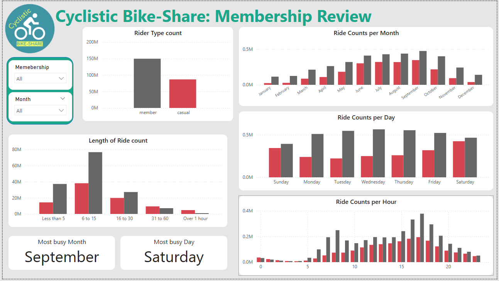
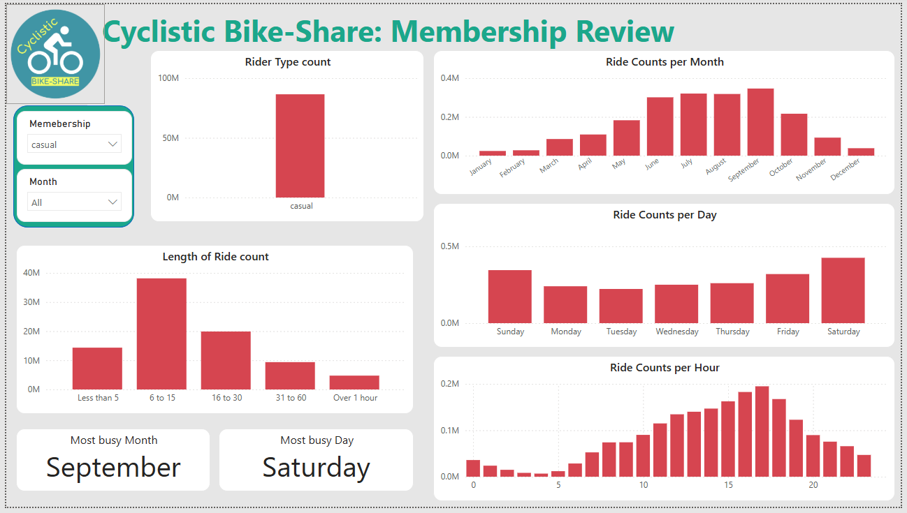
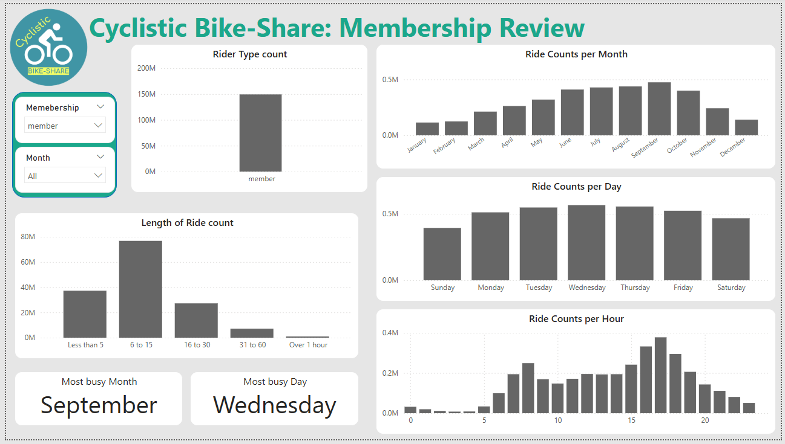
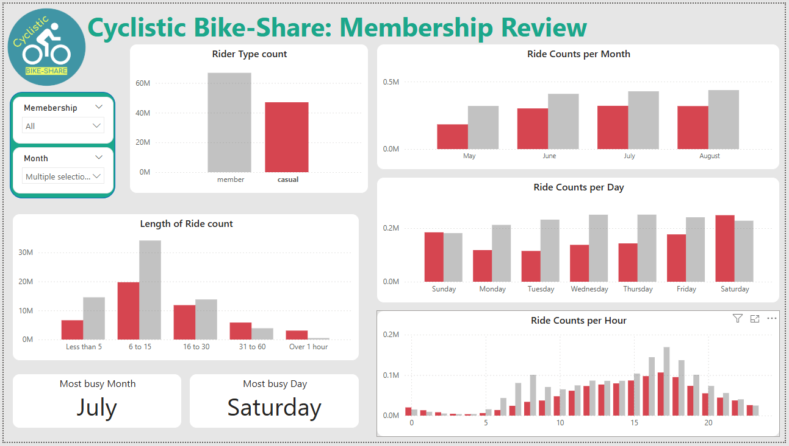
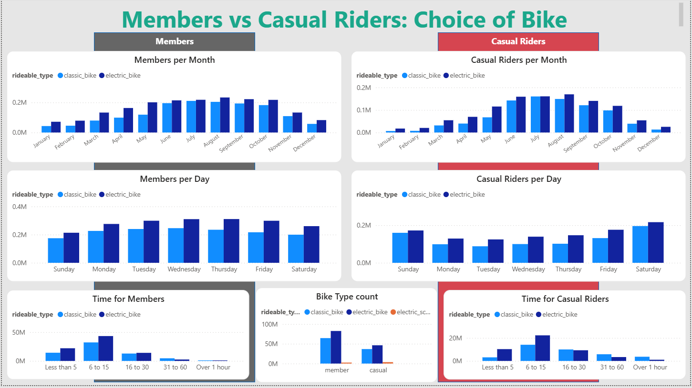
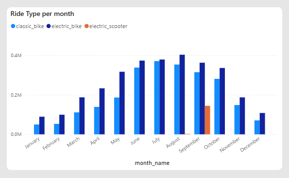

Case Study 1:
# Bike-Share Membership #

## Introduction and Goals ##
**Cyclistic** is a bike-share company operating in Chicago since 2016. The company provides customers access to its fleet of bikes by way of short-term passes (single-ride, full-day) and annual memberships. Customers who purchase short-term passes are referred to as casual riders. Customers who purchase annual memberships are Cyclistic members.

The company’s current marketing strategy is based on a general awareness approach in targeting all potential customers. The director of marketing, Lily Moreno, believes in targeting Cyclistic’s casual rider market and turning more casual riders into members.

Before making such decisions, we must analyze the habits of casual riders and how they differ from members to determine what is holding back these casual riders from purchasing memberships over short-term passes. Once such habits are found, we can determine the incentives and advertising approaches to turn Cyclistic's casual customers into members.

## Findings ##
#### Overview ####

The bar charts on the right side of the image display the total count of riders over the months, days, and hours of the year.

From the top chart focused on **Month**, both members (dark grey) and casual riders (red) follow a similar trend of less riders during the winter / colder months and more during the summer / warmer months. However, as the months get colder, the difference in total rides between members and casual gets stronger. Notice the jump in rides for causal rider between the months of May and June, and teh drop off between September and October. Compare to the more gradual increase and decrease seen in members.

From the middle chart focused on **Day of the Week**, it is clear that casual riders are much more active on the weekends over the Monday-Friday week days while members follow an opposite trend. The count of member rides follows a camel hump shape where peak rides is on Wednesday and less rides on the weekends. Again, note the more smoother ride totals throughout the week for members compared to the more sudden increase and decrease between the weekends and working week days.

The bottom chart focuses on the **24 hours of the day**. The number of member rides have two peaks that correspond to the hours of 7-9AM and 4-6PM.

Based on the above findings, we conclude that **members are more likely to be consistent riders that rely on Cylistic for a commute to work**. This is based off the peak hours in the day which correspond to morning and late afternoon commuting times, more rides during the working week days, and having more rides during all months of the year including the winter months which dwarf the count of casual. **Casual riders on the other hand are more likely to ride for leisure / entertainment**, as ride counts are much more active during the weekends and summer months.

The bottom left plot shows the distribution of rider counts for set lenghts of time. Notice that members overwhelmingly ride for less than 15 minutes which will support our theory on the majority of rides being centered around commuting trips. In addition, for longer rides that last for more than 30 minutes to over one hour, casual riders are more common. This also supports our theory on causal riders including tourists taking longer rides to view the city or wekkend

\
The above image shows the dashboard with a slicer filter on casual riders. Notice that a warmer month (September) and a weekend (Saturday) are recorded as the most popular month and day for casual riders.

\
The above image shows the dashboard with a slicer filter on members. Notice that a weekday is recorded as the most popular day.

\
A highlight based on the summer months for casual riders.

#### Ride Type ####

The bottom center plot shows the distribution of ride types. Electric scooters are clearly not as popular. Why is that?
\
As shown above, it appears that electric scooters was a limited release in August and September. It is otherwise not present in any other month, so we removed it from further analysis.

Back to the origianl image above, we cans see the difference in use between members and casual riders with another variable in the ride type (classic and electric bike). Both members and casual riders tend to ride electric bikes over classic without any strong difference.

\
Something to note is that for longer rides, classic bikes start to gain more preference while shorter rides are mainly paired with electric bikes. Casual riders also adapt classic bikes earlier, as seen in the "16 to 30" minute column, which again support the theory of casual riders being visitors or perhaps riding for the exercise over commuting purposes.

## Summary and Recommendations ##
The customer habits and trends provided valuable information to bike sharing in Chicago. Customers use Cyclistic to bike at times year-round through every month, day, and hour. With that said, casual riders are considered casual for a reason, and Cyclistic may need to consider the below findings.

#### Who are members? Who make up the casual riders? ####
Based on our observations, many members use Cyclistic for their commutes to work. We believe so becasue:
1. the peak hours of rides being around the morning and late afternoon (7-9AM and 4-6PM respectively) whcih will match most 9-5 hour commuting times
2. compared to casual riders, members are more likely to ride during the working week days over the weekends
3. compared to casual riders, members are more likely to ride during the cold and winter months as opposed to just the summer and warmer months
4. members are less likely to ride for more than 30 minutes, with most rides being less than 15 minutes, which supports our claim of members biking less for leisure but rather a commute to go from point A to B

As such, customers are likely to be members because they rely on Cyclistic to ride throughout the year for commutes to work and other practical purposes which support shorter rides with peak activity during weekdays and waking hours. Casual riders are liekly to be tourists or weekend bikers as casual riders ride more during weekends and gain popularity during the warmer months, as well as riding for longer periods of time compared to the number of members who ride for more than 30 minutes.

#### How to increase annual memberships? ####
As of now, there are only 3 options to purchase: the short term passes for single rides and days, or the annual membership that cover an entire year. For current members who ride often to commute to / from work and other practical reasons to get around the city, these annual passes make complete sense. But for casual riders who only ride during the weekends and summer months, an annual membership is not worth the price. Becasue of this, rather than aiming to turn our casual riders into members, instead we belive in introducing a new membership that will bridge the gap between the current short term single passes and the yearly memberships. Some possible membership concepts include:
1. **A seasonal membership active for the summer**
   * Casual riders are much more active during the months of June through Spetember. The number of casual rides during these months dwarf the number of rides in the colder months of December through February. If this "Summer Membership" is introduced, we suggest putting out announcements and advertisements around April or May to get riders aware.
2. **A lower cost annual membership for the weekends**
   * It is clear that current casual riders ride more during the weekends compared to Monday-Friday. These riders are not tourists, but people who often use Cyclistic's bikes for weekend exercises and physcial recreation. Introducing such membership could appeal to these customers who ride on the many weekends throughout the year, but don't ride enough on the many non-weekend days to justify an annual membership. For advertising, perhaps name this the "Sport Membership" or something similar to envoke the idea of exercise and to center advertising on the health of being active with biking.

**Final Words**\
We hope Cyclistic's leadership keep our findings and suggestions to mind. We strongly encourage introducing either or both of the above membership plans. Current casual riders do not ride enough to simply choose our current annual membership plan over our single-use offerings. Introducing new membership plans that target the popular casual riding habits is more likely to satisfy the goal of more members.
